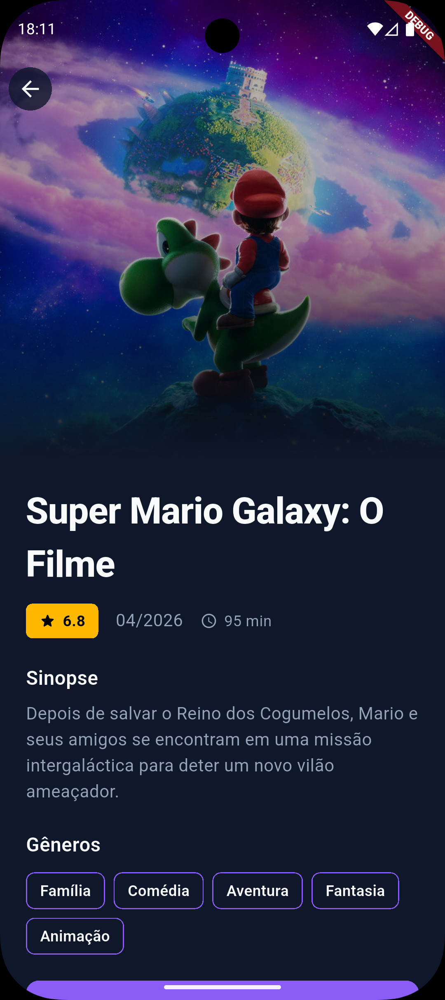
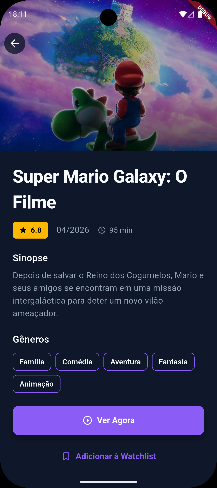

# 🎬 Streaming App - Teste Técnico Flutter

Este projeto foi desenvolvido como um desafio técnico para demonstrar competências em **Flutter**, seguindo os princípios de **Clean Architecture**, gerenciamento de estado robusto e boas práticas de UI/UX.

---

## 📱 O Projeto e Design

O design foi concebido com foco na **objetividade**. Em aplicativos de streaming, o excesso de metadados pode sobrecarregar o usuário no primeiro contato. Por isso, optei por uma interface enxuta que apresenta apenas o que é essencial para a tomada de decisão (Título, Nota e Gêneros).

### Destaques da Interface:

- **PageView de Destaque:** No topo da Home, utilizei um `PageView` com transições animadas automáticas que destaca até 3 filmes selecionados via regra de negócio local.
- **Carrosséis Horizontais:** Implementados com `ListView.builder`, listando os filmes "Em Cartaz" e "Populares" de forma performática.
- **Detalhes Interativos:** Na tela de detalhes, a imagem de fundo possui um efeito interativo que reage ao scroll do usuário, utilizando um `CustomScrollView`.

|                             Home (Destaques)                             |                              Home (Listas)                               |                             Detalhes (Topo)                              |                             Detalhes (Info)                              |
| :----------------------------------------------------------------------: | :----------------------------------------------------------------------: | :----------------------------------------------------------------------: | :----------------------------------------------------------------------: |
|  |  |  |  |

---

## 🏗️ Arquitetura

O projeto utiliza a **Clean Architecture**, separando as responsabilidades em camadas independentes para facilitar a manutenção e a testabilidade.

### Estrutura de Pastas:

```text
lib
├── core               # Componentes transversais (Injeção, Redes, Temas, Widgets base)
│   ├── helper
│   ├── injection      # Configuração do GetIt
│   ├── network        # Interceptor do Dio e clientes HTTP
│   ├── router         # Configuração do GoRouter
│   ├── theme          # Tipografia e cores do sistema
│   └── widget         # Widgets globais reaproveitáveis
├── feature            # Módulos da aplicação
│   ├── home           # Módulo da tela inicial
│   │   ├── data       # Datasources, Models e Repositories
│   │   ├── domain     # Usecases, Entities e Repositories (Contratos)
│   │   └── presentation # Telas (Screens) e Gerência de estado (Cubit)
│   └── movies         # Módulo de detalhes e lógica de filmes
└── main.dart          # Ponto de entrada
```

## 🛠️ Tecnologias e Pacotes

Gerência de Estado: flutter_bloc (Cubit) para um controle de estado reativo e previsível.

Navegação: go_router para rotas nomeadas e integradas.

Injeção de Dependência: get_it para desacoplamento de classes.

Rede & API: dio com retrofit para consumo da API do TMDB e mapeamento automático.

Performance: cached_network_image para gerenciamento eficiente de cache.

Estabilidade: equatable para comparação de objetos e mockito para mocks.

## 🚀 Como Executar o Projeto

Pré-requisitos:

Flutter instalado (versão >= 3.2.0).

Um dispositivo Android ou Emulador configurado.

### 1. Configuração da API

Este projeto utiliza a API do TMDB. Para rodar:

Crie um arquivo chamado .env na raiz do projeto.

Adicione sua chave da API no seguinte formato:

```text
API_KEY=SUA_CHAVE_AQUI
```

### 2. Rodar o App (Android)

No terminal, execute os seguintes comandos:

```Bash
# Baixar dependências
flutter pub get

# Gerar arquivos do Retrofit e JSON Serializer
flutter pub run build_runner build --delete-conflicting-outputs

# Executar o projeto
flutter run
```

## 🧪 Testes e Cobertura

O projeto foi estruturado para ser testável. Para rodar os testes unitários e verificar a cobertura:

Executar testes:

```Bash
flutter test
```

Gerar relatório de cobertura (Coverage):

```Bash
flutter test --coverage
```

✒️ Considerações Finais
Este projeto reflete minha abordagem atual para desenvolvimento mobile: código limpo, interfaces fluidas e uma arquitetura que permite escala sem gerar dívida técnica.

---
